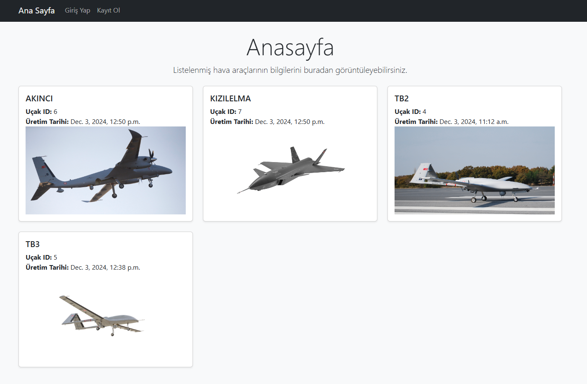
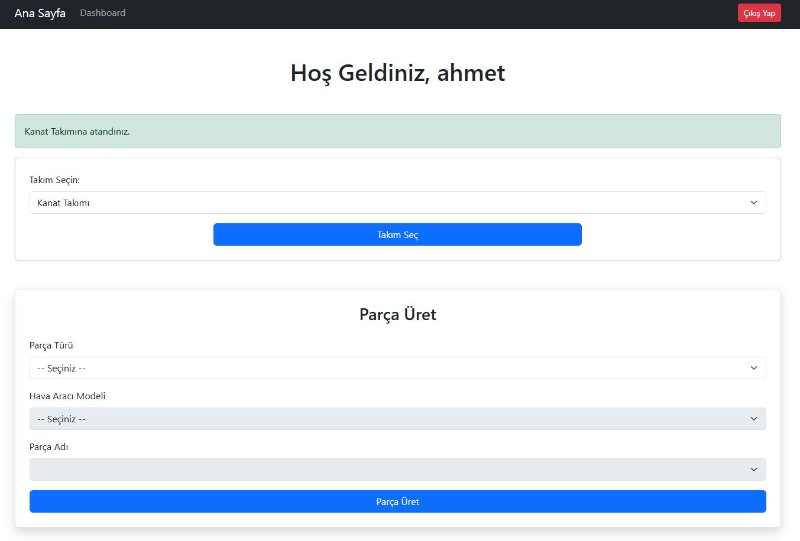
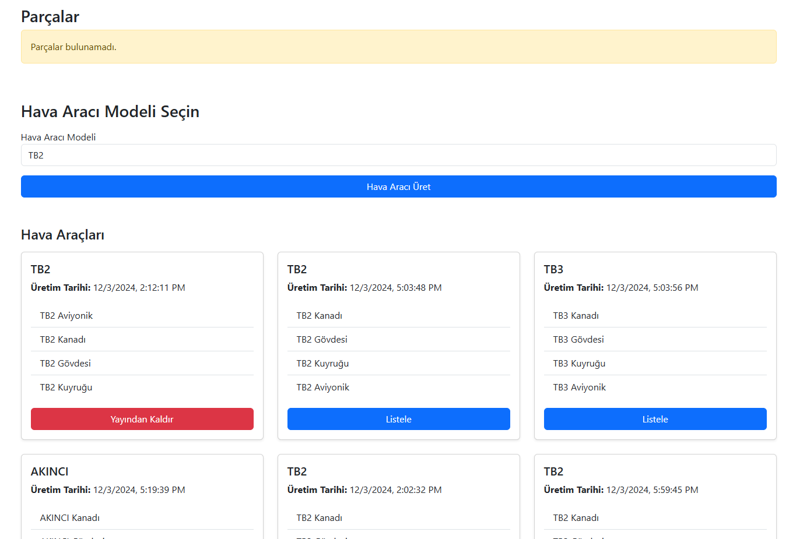
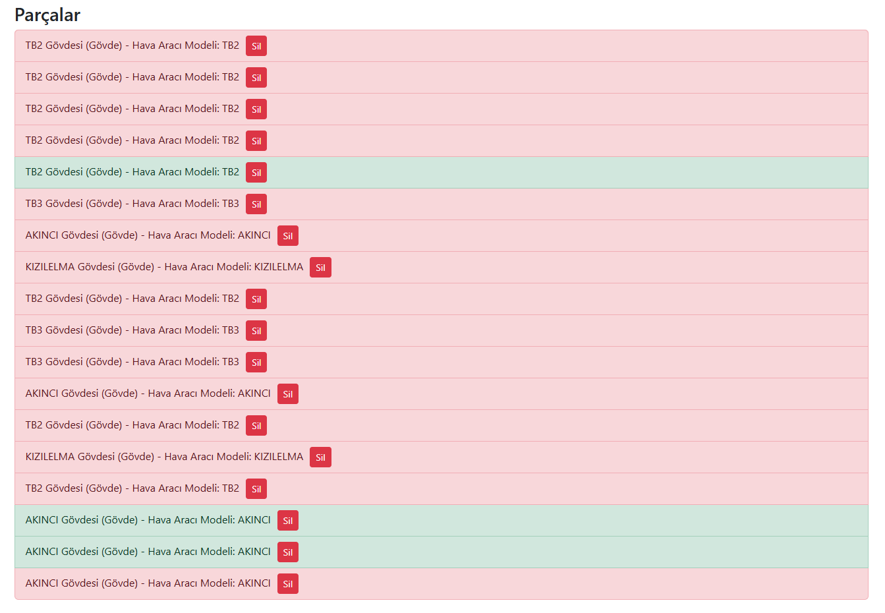
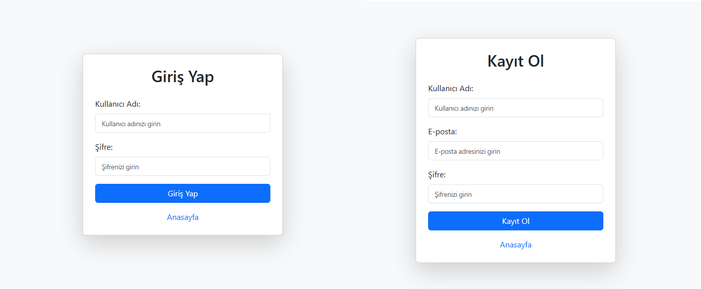
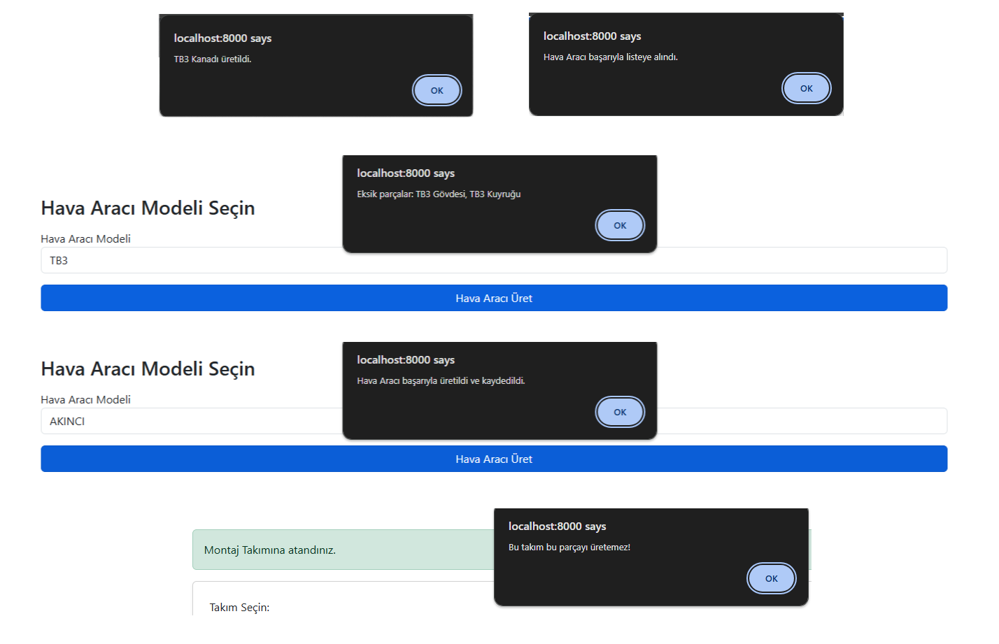
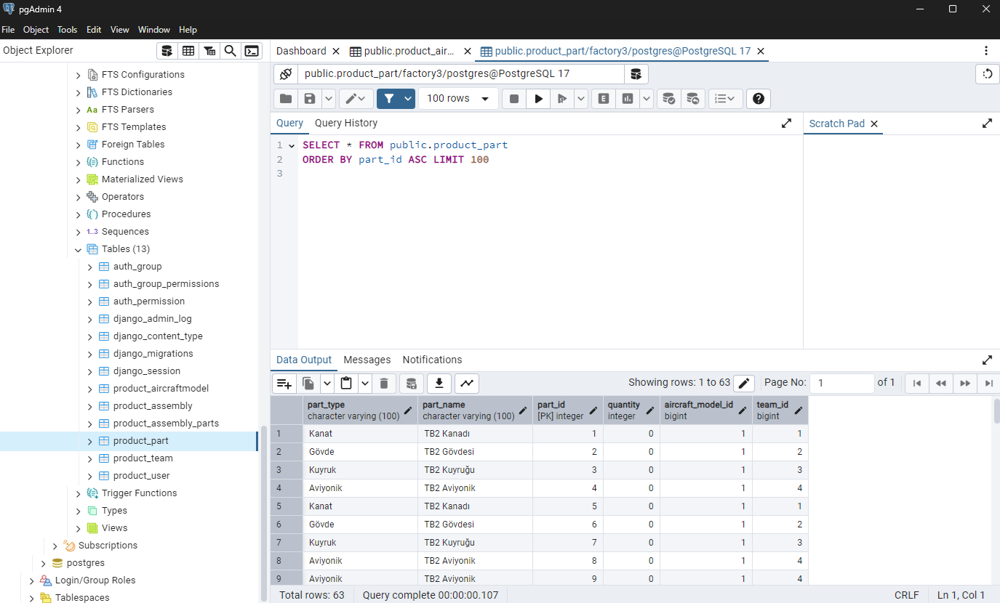

## *Hava Aracı Üretim Uygulaması*

## *Proje Hakkında*
Bu proje, insansız hava aracı parçalarının yönetimini ve üretim süreçlerini kolaylaştırmak için geliştirilmiş bir sistemdir. Kullanıcıların parçaları takip etmelerine, eksik parçaları kontrol etmelerine ve bir hava aracı üretim sürecini simüle etmelerine olanak tanır. Proje, hem frontend hem de backend teknolojileri kullanılarak tasarlanmıştır.

```
Baykar
Hava Aracı Üretim Uygulaması
```
---

## *Projenin Amacı*
- İnsansız Hava Aracı üretim sürecindeki parçaların yönetimini sağlamak.
- Kullanıcılara eksik parçaları tespit etme ve süreçleri görselleştirme imkânı sunmak.
- Dinamik bir CRUD (Create, Read, Update, Delete) altyapısı oluşturmak.

---

## *Kullanılan Teknolojiler*
### *Backend:*
- *Python*
- *Django*
- *Django REST Framework*
- *PostgreSQL*

### *Frontend:*
- *HTML5 / CSS3*
- *Bootstrap 5*
- *JavaScript*

---

## *Fonksiyonlar*
1. *Giriş ve Kayıt İşlemleri:*
   - Kullanıcılar, sisteme kayıt olabilir ve giriş yapabilir.
   - Giriş yapmayan kullanıcılar "Dashboard" gibi özel sayfalara erişemez.

2. *Parça Yönetimi:*
   - Veritabanında bulunan hava aracı parçalarını listeleme.
   - Eksik parçaları kontrol ederek kullanıcıya bilgi verme.
   - Kullanılan parçaların stok miktarını güncelleme.

3. *Hava Aracı Üretimi:*
   - Montaj takımındaki kullanıcılar, bir hava aracı modelini seçerek üretim işlemini başlatabilir.
   - Uygun parçalarla üretim gerçekleşir, eksik parçalar sistem tarafından belirtilir.

4. *Dashboard:*
   - Kullanıcıların üretim geçmişini ve hava aracı modellerini görmesine olanak tanır.

---

## *Veritabanı Yapısı ve Örnek Veriler*

### *Tablolar:*
- *User:* Kullanıcıları saklar.
- *Team:* Kullanıcı takımlarını belirtir.
- *Part:* Hava Aracı parçalarını yönetir.
- *AircraftModel:* Hava Aracı modellerini saklar.
- *Assembly:* Üretilen hava araçlarının kaydını tutar.
- *Assembly Parts:* Üretilen hava araçlarının parçalarının kaydını tutar.

### *Başlangıçta Girilmesi Gereken Veriler:*
Takım tablosu (product_team);

```
INSERT INTO product_team (id, name, can_manage_parts, allowed_part_types) VALUES
(1, 'Kanat Takımı', true, '["Kanat"]'),
(2, 'Gövde Takımı', true, '["Gövde"]'),
(3, 'Kuyruk Takımı', true, '["Kuyruk"]'),
(4, 'Aviyonik Takımı', true, '["Aviyonik"]'),
(5, 'Montaj Takımı', false, '[]');
```
Hava aracı modeli tablosu (product_aircraftmodel);

```
INSERT INTO product_aircraftmodel (name) 
VALUES 
('TB2'),
('TB3'),
('AKINCI'),
('KIZILELMA');
```
---

## *Proje Geliştirme Süreci*
Bu projeyi geliştirme sürecim hem teknik hem de kişisel anlamda bir öğrenme deneyimiydi. Projeyi geliştirirken:
- Django, REST API ve PostgreSQL konusunda kendimi geliştirdim.
- JavaScript ile frontend ve backend arasında verimli bir iletişim kurmayı öğrendim.
- Bootstrap ile pratik bir şekilde UI tasarımı oluşturdum.

Bu projede Django ve PostgreSQL teknolojilerini daha önce kullanmamış olmam nedeniyle, verilen süre zarfında hem bu teknolojileri öğrenmeye hem de projeyi tamamlamaya çalıştım. Bu sebeple, olabilecek hatalar için anlayışınızı rica ederim.

---

## *Kurulum Talimatları*
1. Projeyi klonlayın:
   ```
   git clone https://github.com/berkercelik/uav-production-app.git
   ```
2. Sanal bir ortam oluşturun ve aktif hale getirin:
   ```
   python -m venv env   
   source env/bin/activate  # Windows'da: .\env\Scripts\activate
   ```
3. Gereksinimleri yükleyin:
   ```
   pip install environ django-cors-headers psycopg psycopg2-binary
   ```
   ```
   pip install djangorestframework markdown django-filter 
   ```
   
4. Veritabanını oluşturun ve migrate işlemini yapın:
   ```
   python manage.py makemigrations
   ```
   ```
   python manage.py migrate
   ```
   
5. Sunucuyu başlatın:
   ```
   python manage.py runserver
   ```
   
6. Uygulamayı tarayıcınızda açın:
   
   http://127.0.0.1:8000/ veya http://localhost:8000/
   
---

## *Proje Görselleri*
### *Ana Sayfa*


### *Dashboard*


### *Dashboard 2*


### *Dashboard 3*


### *Giriş ve Kayıt Ol*


### *Uyarılar*


### *Veri Tabanı*


---

## *İletişim*
Eğer bu projeyle ilgili sorularınız varsa veya katkıda bulunmak isterseniz, bana ulaşabilirsiniz:
- *GitHub:* [berkercelik](https://github.com/berkercelik)

---